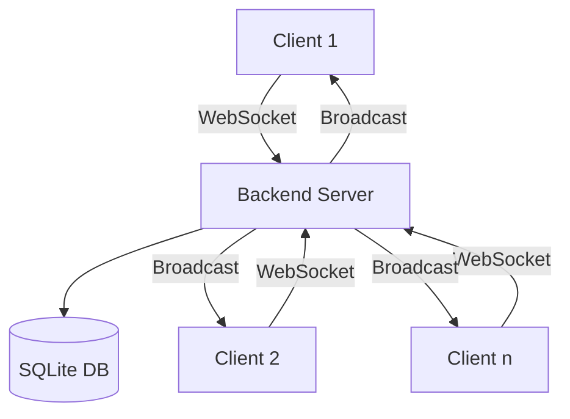
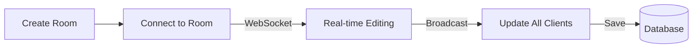

# System Patterns

## Architecture Patterns

### Real-time Collaboration System

### Room Management Flow

## Key Design Patterns

1. **WebSocket Communication Pattern**
   - Persistent bidirectional connection
   - Real-time content synchronization
   - User count broadcasting
   - Connection state management

2. **Room Security Pattern**
   - Password protection system
   - Room locking mechanism
   - Auto-locking for inactive rooms
   - Access validation

3. **Data Persistence Pattern**
   - SQLite for data storage
   - Room content versioning
   - Admin content management
   - Timestamp tracking

4. **Real-time Selection Pattern**
   - Track and broadcast cursor selections
   - Visual highlighting of remote selections
   - Client ID management for selection attribution
   - Selection clearing synchronization

5. **Component Architecture**
   - Monaco Editor integration
   - Room password modal
   - Admin panel
   - Home page navigation

6. **Text Highlighting Pattern**
   - Real-time highlight synchronization across clients
   - Multiple user highlight support with unique colors
   - Highlight persistence during editing
   - Efficient highlight state management
   - Conflict resolution for overlapping highlights

## Key Implementation Paths

### Room Creation and Connection
1. Create room via REST API
2. Initialize WebSocket connection
3. Set up content synchronization
4. Manage active connections

### Content Synchronization
1. Receive content updates via WebSocket
2. Broadcast to other connected clients
3. Synchronize text highlights across clients
4. Persist changes to database
5. Handle disconnections gracefully

### Security Implementation
1. Room password validation
2. Auto-locking mechanism
3. Connection validation
4. Admin content protection

### Admin Features
1. Content management CRUD operations
2. Room monitoring
3. Manual room locking
4. Content administration
